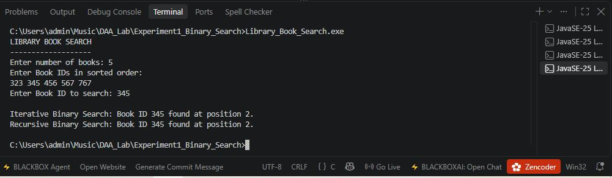

# Experiment No. 1

## Binary Search Techniques Using Array and Recursion

---

## Aim

To implement Binary Search techniques using **Array and Recursion** and apply them to real-world applications.

---

## Objective

* To understand the concept of Binary Search.
* To implement Binary Search using an iterative approach.
* To implement Binary Search using a recursive approach.
* To apply Binary Search to real-world applications.
* To analyze the time and space complexity of Binary Search.

---

## Theory

**Binary Search** is an efficient searching technique used to find an element in a **sorted array**.

The search range is divided into two halves at every step.

### Working of Binary Search

1. Find the middle element of the sorted array.
2. Compare the middle element with the search key.
3. If both are equal, the element is found.
4. If the key is greater than the middle element, search the right half.
5. If the key is smaller than the middle element, search the left half.
6. Repeat the process until the element is found or the search range becomes empty.

Binary Search can be implemented using:

* **Iterative Method**
* **Recursive Method**

---

# Applications

This experiment contains three real-world applications:

1. **Library Book Search**
2. **Hospital Patient Search**
3. **College Seat Number Search**

---

# Application 1: Library Book Search

### Description

This program searches for a **Book ID** from a sorted list of Book IDs using both Iterative and Recursive Binary Search.

### Source File

`Library_Book_Search.c`

### Sample Input

```text
Enter number of books: 5
Enter Book IDs in sorted order:
323 345 456 567 767
Enter Book ID to search: 345
```

### Output

```text
Iterative Binary Search: Book ID 345 found at position 2.
Recursive Binary Search: Book ID 345 found at position 2.
```

### Application

Binary Search can be used in a **Library Management System** to quickly search for books using their unique Book IDs.

### Output Screenshot



---

# Application 2: Hospital Patient Search

### Description

This program searches for a **Patient ID** from a sorted list of Patient IDs using both Iterative and Recursive Binary Search.

### Source File

`Hospital_Patient_Search.c`

### Sample Input

```text
Enter number of patients: 5
Enter Patient IDs in sorted order:
101 205 309 412 518
Enter Patient ID to search: 309
```

### Output

```text
Iterative Binary Search: Patient ID 309 found at position 3.
Recursive Binary Search: Patient ID 309 found at position 3.
```

### Application

Binary Search can be used in a **Hospital Management System** to quickly search patient records using their unique Patient IDs.

### Output Screenshot


---

# Application 3: College Seat Number Search

### Description

This program searches for a **Seat Number** from a sorted list of Seat Numbers using both Iterative and Recursive Binary Search.

### Source File

`Seat_Number_Search.c`

### Sample Input

```text
Enter number of seats: 5
Enter Seat Numbers in sorted order:
101 205 309 412 518
Enter Seat Number to search: 309
```

### Output

```text
Iterative Binary Search: Seat Number 309 found at position 3.
Recursive Binary Search: Seat Number 309 found at position 3.
```

### Application

Binary Search can be used in a **College Examination System** to quickly search student seat numbers.

### Output Screenshot


---

# Algorithm

## Iterative Binary Search

```text
1. Set low = 0 and high = n - 1.
2. Calculate mid = (low + high) / 2.
3. Compare the middle element with the search key.
4. If the middle element equals the key, return its position.
5. If the key is greater, search the right half.
6. If the key is smaller, search the left half.
7. Repeat until low > high.
8. If the key is not found, return -1.
```

---

## Recursive Binary Search

```text
1. Set low and high values.
2. Calculate the middle position.
3. Compare the middle element with the search key.
4. If the middle element equals the key, return its position.
5. If the key is greater, recursively search the right half.
6. If the key is smaller, recursively search the left half.
7. If low > high, return -1.
```

---

# Time Complexity

| Case         | Iterative | Recursive |
| ------------ | --------- | --------- |
| Best Case    | O(1)      | O(1)      |
| Average Case | O(log n)  | O(log n)  |
| Worst Case   | O(log n)  | O(log n)  |

---

# Space Complexity

| Method                  | Space Complexity |
| ----------------------- | ---------------- |
| Iterative Binary Search | O(1)             |
| Recursive Binary Search | O(log n)         |

The recursive approach requires additional stack space because of recursive function calls.

---

# Advantages

* Fast searching for sorted data.
* Reduces the search space by half at every step.
* Efficient for large datasets.
* Simple and easy to implement.
* Both iterative and recursive approaches can be used.

---

# Limitations

* The input array must be **sorted**.
* Maintaining sorted data may require additional processing.
* Recursive implementation requires extra stack memory.

---

# Applications

Binary Search can be used in:

* Library Management Systems
* Hospital Management Systems
* College Examination Systems
* Student Record Management
* Employee Record Management
* Database Searching
* Searching Sorted Arrays
* Admission and Seat Allocation Systems

---

# Comparison

| Feature          | Iterative    | Recursive      |
| ---------------- | ------------ | -------------- |
| Technique        | Loop-based   | Function-based |
| Time Complexity  | O(log n)     | O(log n)       |
| Space Complexity | O(1)         | O(log n)       |
| Extra Stack      | Not required | Required       |
| Implementation   | Simple       | Recursive      |

---

# Files in This Experiment

```text
Experiment1_Binary_Search/
│
├── Library_Book_Search.c
├── Hospital_Patient_Search.c
├── Seat_Number_Search.c
├── README.md
│
└── Output/
    ├── Library_Output.png
    ├── Hospital_Output.png
    └── Seat_Output.png
```

---

# Conclusion

Binary Search is an efficient searching technique for sorted data.

In this experiment, Binary Search was successfully implemented using both **Iterative and Recursive approaches** and applied to three real-world applications:

1. Library Book Search
2. Hospital Patient Search
3. College Seat Number Search

Binary Search provides **O(log n)** time complexity in average and worst cases. The iterative approach requires **O(1)** extra space, while the recursive approach requires **O(log n)** stack space.

Therefore, Binary Search is an efficient technique for searching large amounts of sorted data.
